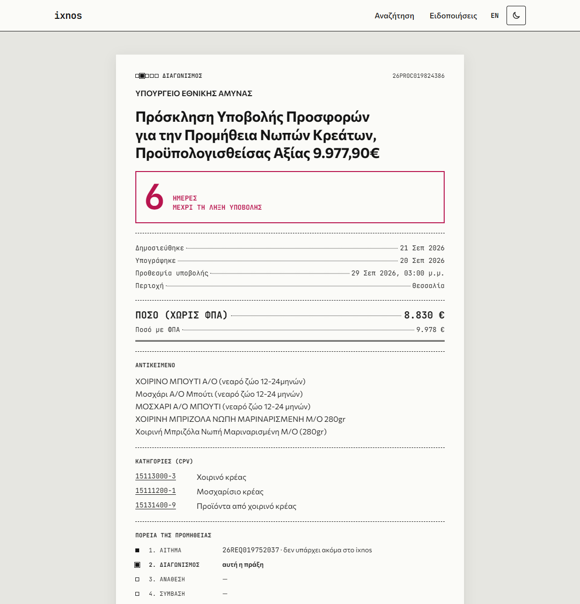
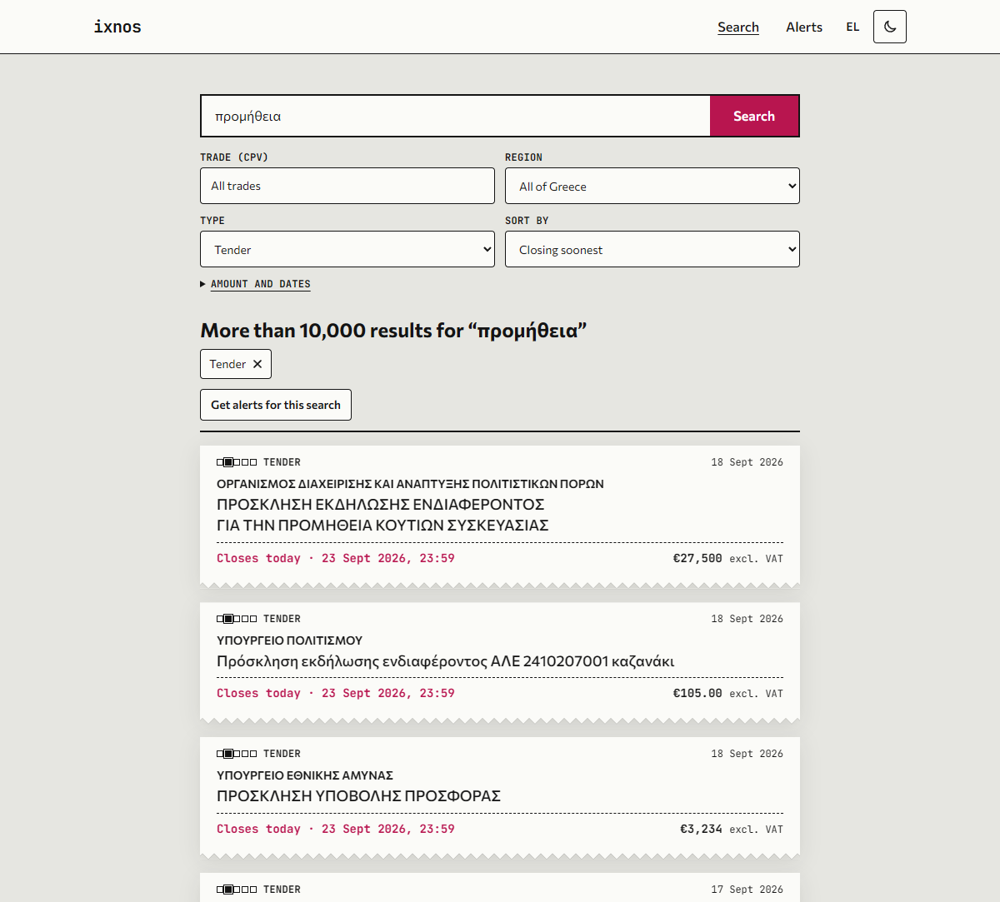
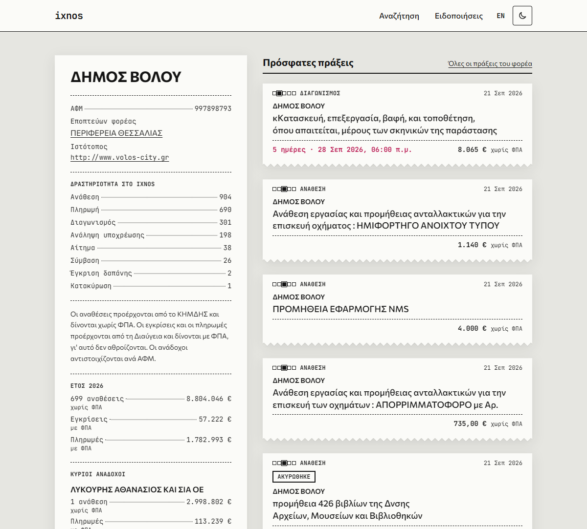
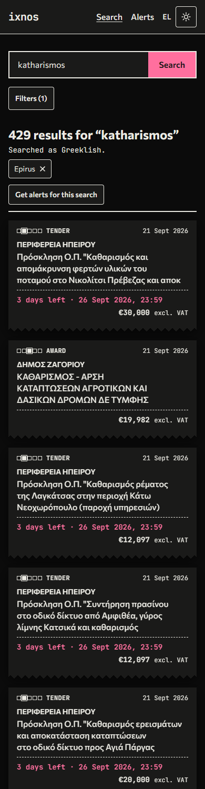
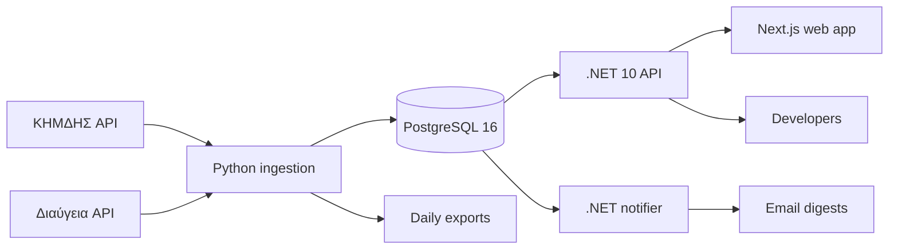

# ixnos-data

> Πού πάνε τα λεφτά; Where does the money go?

**ixnos-data** makes Greek public procurement and spending data searchable, alertable and
available through a public API. It is free and open source, and it is not an official
government service. The name comes from the Greek ίχνος (trace): following the trail of public
money.

Tenders (ΚΗΜΔΗΣ) and spending decisions (Διαύγεια) are already public, but they are hard to
search, written in dense administrative Greek, and not pushed to anyone. A small business has
no easy way to learn that a nearby authority just posted a tender for what it sells.



## What it does

- **For small businesses and freelancers**
  - Search tenders by trade (CPV), region, amount and date, in Greek or Greeklish, with or
    without accents and typos.
  - Save a search and get an email with anything new, every morning or every Monday.
  - See each open tender's deadline as a countdown, and add it to a calendar.
  - Follow any search by RSS, or download its results as CSV.
- **For citizens and journalists**
  - Organisation pages put what an authority *awarded* (ΚΗΜΔΗΣ) next to what it *approved and
    paid* (Διαύγεια).
  - The main contractors, matched across both sources by VAT number.
  - Every record links to its official document, and to similar records.
  - Neutral signals worth a second look: a competitive tender with a single offer, a direct
    award just under the legal limit, one supplier with most of an authority's awards
    ([ADR 0012](docs/adr/0012-neutral-procurement-signals.md)).
- **For developers and researchers**
  - A documented public API with free keys and their own rate limits.
  - Daily bulk exports of every record (CSV and JSON Lines).
  - Client libraries for .NET and Python (`clients/`).
  - A public status page with ingestion lag, fetch history and usage.

The interface is in Greek and English, in light and dark themes, and works without JavaScript.

| Search | Organisation | Phone, dark theme |
| --- | --- | --- |
|  |  |  |

## Status

**Built and tested; not deployed yet.**
- **Built:** ΚΗΜΔΗΣ and Διαύγεια ingestion, search, accounts and alerts, organisation spending,
  the public API with keys and docs, and bulk exports.
- **Tested:** the full production setup (HTTPS, cron jobs, digest, exports, backups and a
  restore) has run end to end on a development machine.

## How it works



Four services share one PostgreSQL database and nothing else, so each can fail and deploy on
its own ([ADR 0002](docs/adr/0002-database-as-only-integration-point.md)). The Python pipeline
fetches, validates and upserts; the API reads with hand-written SQL for search and EF Core for
writes; the notifier is a separate one-shot process run by cron, so a mail outage can never
take the site down.

| Layer | Stack |
| --- | --- |
| API, notifier | .NET 10, ASP.NET Core Minimal APIs, Clean Architecture, EF Core, Dapper |
| Pipeline | Python 3.12, httpx, Pydantic, SQLAlchemy Core, uv |
| Database | PostgreSQL 16: full-text search with a Greek configuration, `pg_trgm`, `unaccent` |
| Web | Next.js 16 (App Router, server components), TypeScript, Tailwind 4, next-intl |
| Operations | Docker Compose, Caddy (HTTPS), GitHub Actions, GHCR, cron |
| Tests | xUnit with Testcontainers, pytest, Vitest, Playwright |

## The hard parts

**Greek search that forgives people.** People type «καθαρισμος», «katharismos» or
«κλιματηστικών».
- **Approach:** one normaliser, shared by Python and .NET and tested against the same cases,
  folds accents, final sigma and Latin look-alike letters.
- **Matching:** PostgreSQL full-text search with a Greek stemmer, trigram similarity for typos,
  and phonetic keys for Greeklish.
- **Results:** a set of 56 real queries scores precision@10 of 0.84–1.00 per category, and
  deploys fail if it drops.

**Two sources that describe the same money differently.**
- ΚΗΜΔΗΣ states amounts without VAT, Διαύγεια with VAT, and Διαύγεια awards restate ΚΗΜΔΗΣ
  ones. ixnos-data keeps them apart, labelled, and joins them by VAT number rather than adding them
  up ([ADR 0009](docs/adr/0009-diavgeia-amounts-with-vat.md)).
- Corrections in Διαύγεια point to the decision they replace by an internal version ID, not
  its public number. The pipeline resolves that in either arrival order, so the old version
  leaves totals.

**Measuring before modelling.**
- Before any schema, probes pulled six months of ΚΗΜΔΗΣ and three weeks of Διαύγεια: 614,000
  records.
- The findings decided the schema:
  - titles are cut at 100 characters;
  - notices list the place of work separately from the authority's address (they differ on
    15%);
  - ΚΗΜΔΗΣ answers 404 for days with no records yet;
  - some payments are typos over €100 million.
- Findings: [docs/data-sources/](docs/data-sources/).

**Alerts that never double-send.**
- The digest records deliveries and its checkpoint before sending, so a crash or a rerun can
  miss at most one email and never repeats one.
- Sign-in is by emailed link. Only hashes of link, session and API-key tokens are stored
  ([ADR 0008](docs/adr/0008-magic-link-accounts.md)).

**Privacy by construction.** Public records name sole traders.
- ixnos-data shows them on the records they appear in, never on a person's own page.
- The API never returns contractor VAT numbers, and the bulk exports carry no contractor data
  at all ([ADR 0010](docs/adr/0010-api-keys-and-bulk-exports.md)).

## Running it locally

With only Docker installed, one command builds and starts the database, API and web app, and
fetches the latest records:

```bash
./scripts/start.sh                  # or ./scripts/start.sh <snapshot file or URL> for full history
```

A snapshot is a database dump without accounts, made by `scripts/make-snapshot.sh`; with
`--public` it also leaves out contractors' VAT numbers, so it can be shared publicly.

For development, install the toolchains as well: .NET SDK 10, Python 3.12 with
[uv](https://docs.astral.sh/uv/), Node.js 24 with pnpm.

```bash
./scripts/dev-setup.sh      # checks tools, creates .env, installs dependencies
docker compose up --build   # Postgres (port 5433), API (8080), web app (3000)
```

Common tasks (or see the `Makefile`):

```bash
dotnet test backend/IxnosData.slnx          # .NET tests (integration tests need Docker)
cd pipeline && uv run pytest            # Python tests (integration tests need Docker)
cd web && pnpm test && pnpm e2e         # web unit and end-to-end tests
./scripts/generate-contracts.sh         # after changing API endpoints or migrations
```

The production setup (Caddy, cron jobs, backups) can run on a development machine too: see
[infra/README.md](infra/README.md).

## Repository

| Folder | What lives there |
| --- | --- |
| `backend/` | .NET 10 API and notifier (Clean Architecture, feature folders) |
| `pipeline/` | Python ingestion, source clients, reference data, exports, search-quality scoring |
| `web/` | Next.js web app (Greek default, English) |
| `clients/` | .NET and Python client libraries (MIT) |
| `contracts/` | OpenAPI contract, SQL schema, shared normaliser cases, search test set |
| `infra/` | Production Compose, Caddy, crontab, backup and restore scripts |
| `docs/` | Architecture, ADRs, data-source findings, runbooks, launch checklist |

## Contributing

Contributions are welcome, especially from people who know Greek public administration or
procurement. See [CONTRIBUTING.md](CONTRIBUTING.md) and the
[code of conduct](CODE_OF_CONDUCT.md). To report a security issue, see
[SECURITY.md](SECURITY.md).

## Data and licence

The code is licensed under [AGPL-3.0](LICENSE).

Data comes from public sources, each under its own terms:

- **ΚΗΜΔΗΣ open data** (Ministry of Digital Governance), CC BY 4.0.
- **Διαύγεια open data** (Ministry of Digital Governance), CC BY 4.0. Reuse is free when the
  source is credited ([terms](docs/data-sources/diavgeia.md#reuse-terms)).
- **CPV 2008** (© European Union, EU Publications Office) and **NUTS 2024** (© European Union,
  Eurostat).

ixnos-data shows records as published. Sole traders can appear by name in public procurement
records; ixnos-data builds no personal profiles and honours removal requests.
