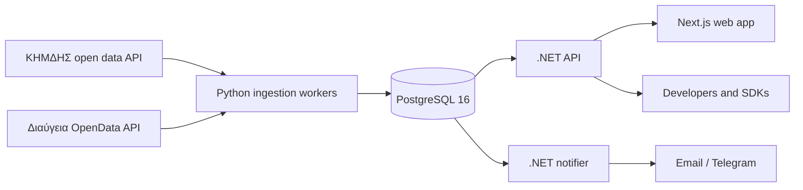

# Architecture

ixnos-data collects Greek public procurement and spending records from two public APIs, makes them
searchable in Greek and Greeklish, alerts users to new matches, and serves everything through a
public API. Four services share one PostgreSQL database and nothing else
([ADR 0002](adr/0002-database-as-only-integration-point.md)).

## Services

| Service | Folder | Does | Writes | Reads |
| --- | --- | --- | --- | --- |
| Ingestion workers | `pipeline/` | Fetch, validate (Pydantic), normalise, deduplicate on ΑΔΑΜ/ΑΔΑ, upsert. Hourly for new records, nightly for re-checks and backfill | records, organisations, contractors, links, `ingestion_run` | source APIs |
| API | `backend/src/IxnosData.Api` | Public search, record and organisation endpoints under `/v1`; accounts and saved searches from Phase 2 | accounts, saved searches | everything |
| Notifier | `backend/src/IxnosData.Notifier` (Phase 2) | Match new records against saved searches, send daily digests | `alert_delivery` | records, saved searches |
| Web app | `web/` | Server-rendered Greek (default) and English pages, search, account area | nothing (through the API) | the API |

## Data flow

1. **Fetch.** Each source has a client (`pipeline/src/ixnos_data_pipeline/sources/<source>/client.py`)
   behind a shared rate-limited HTTP client that spaces requests and retries timeouts, 429s and
   5xx errors. Queries run one submission day at a time. Raw pages for days that are over are
   cached, so a long pull can resume and reprocessing needs no refetch.
2. **Validate and transform.** Pydantic models (written from real responses, because the ΚΗΜΔΗΣ
   spec leaves record bodies untyped) normalise dates, references and code lists. The raw
   payload is kept in `jsonb` next to the parsed columns.
3. **Store.** Upserts keyed on the source identifier (ΑΔΑΜ for ΚΗΜΔΗΣ, ΑΔΑ for Διαύγεια).
   Every run is recorded in `ingestion_run` (`common/runs.py`), which alarms and the status page
   read.
4. **Link.** ΚΗΜΔΗΣ records reference each other (request → notice → award → contract →
   payment) and Διαύγεια decisions by ΑΔΑ. Organisations share IDs and VAT numbers across both
   sources. These become `item_link` rows (Phase 3).
5. **Serve.** The API searches with PostgreSQL full-text search (`ixnos_data_greek` configuration:
   accents removed, Greek Snowball stemmer), `pg_trgm` for typos, and phonetic keys for
   Greeklish. Filters (CPV, NUTS, amount, date) are indexed columns
   ([ADR 0004](adr/0004-codes-before-ml-classification.md)).
6. **Alert.** The notifier polls for records newer than its checkpoint
   ([ADR 0003](adr/0003-polling-over-message-queue.md)) and logs each send, so a crash never
   sends an alert twice.

## Greek text

PostgreSQL's Greek stemmer already ignores accents and final sigma, so full-text search needs
no preprocessing. The shared normaliser (`GreekText` in .NET, `greek_text` in Python) serves
what the stemmer cannot: accent- and case-insensitive trigram matching, Latin look-alike letters
inside Greek words (`ΠPOMHΘEIA`), and Greeklish queries mapped to phonetic keys (`promh8eia`
finds `προμήθεια`). Both implementations pass the same cases in
`contracts/text-normalisation/cases.json`.

## Contracts between languages

Everything two languages must agree on lives in `contracts/`. It is generated from the owning
code where possible and checked in CI
([ADR 0007](adr/0007-contracts-generated-and-checked.md)).

## Backend structure

Clean Architecture with feature folders
([ADR 0005](adr/0005-clean-architecture-with-feature-folders.md)): `IxnosData.Domain` (entities),
`IxnosData.Application` (use cases, interfaces, `GreekText`), `IxnosData.Infrastructure` (EF Core,
Dapper queries, email), and the hosts `IxnosData.Api` and `IxnosData.Notifier`. Architecture tests
enforce the dependency rule.

## Environments

- **Local:** `docker compose up --build` runs Postgres (host port 5433), the API (8080) and the
  web app (3000). `docker compose run --rm pipeline` runs one ingestion.
- **Production (Phase 1):** a Hetzner VPS in Germany running the same images with Caddy for
  HTTPS, deployed by GitHub Actions. Migrations run before the new API starts.

## Source facts that shaped the design

Measured in the September 2026 probes (`docs/data-sources/`):

- ΚΗΜΔΗΣ rate-limits hard (429 at ~2 s spacing) and occasionally stalls a request, so the
  client waits 4 s between requests and retries with backoff. Filters apply to *submission*
  date, which suits incremental ingestion.
- Διαύγεια caps every search to a 180-day issue-date window and 500 results per page. Payment
  decisions (Β.2.2) run to about 9,000 per weekday.
- ΚΗΜΔΗΣ contracts reference Διαύγεια Β.1.3 commitments by ΑΔΑ, and 44% of sampled ΚΗΜΔΗΣ
  contractors appear as payees in Διαύγεια payments, so cross-source linking by ΑΔΑ and VAT
  number is feasible.
